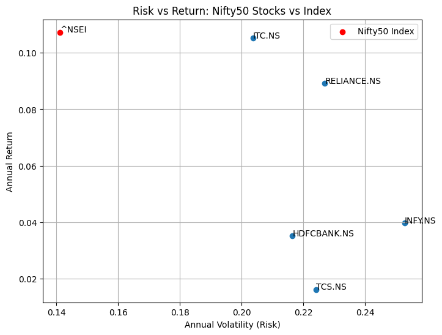

# Report: CAPM Risk-Return Analysis of Nifty50 Stocks

## 1. Introduction
This report interprets the results of a CAPM-based analysis of five major Nifty50 stocks — Reliance Industries (RELIANCE), Tata Consultancy Services (TCS), HDFC Bank (HDFCBANK), Infosys (INFY), and ITC — relative to the Nifty50 index, over the period January 2021 to September 2026. The objective is to evaluate each stock's risk and return profile and assess whether active stock selection outperformed the broader market index.

## 2. Risk and Return Summary

| Stock | Annual Return | Annual Volatility | Sharpe Ratio |
|---|---|---|---|
| HDFC Bank | 3.5% | 21.6% | 0.16 |
| Infosys | 4.0% | 25.3% | 0.16 |
| ITC | 10.5% | 20.4% | 0.52 |
| Reliance | 8.9% | 22.7% | 0.39 |
| TCS | 1.6% | 22.4% | 0.07 |
| **Nifty50 Index** | **10.7%** | **14.1%** | **0.76** |

The Nifty50 index delivered a comparable or higher return than every individual stock in the sample, while carrying substantially lower volatility. This resulted in the index having the highest Sharpe ratio (0.76) — meaning it offered the best return per unit of risk taken. No individual stock matched this efficiency, illustrating the diversification benefit of holding a broad index rather than concentrated single-stock positions. 

TCS stood out as the weakest performer, with the lowest annual return (1.6%) and Sharpe ratio (0.07) despite volatility similar to its peers — indicating that its risk was not well compensated by returns over this period.

## 3. CAPM Regression Results

| Stock | Alpha | Beta | R-squared |
|---|---|---|---|
| Reliance | -0.0001 | 1.09 | 0.46 |
| TCS | -0.0003 | 0.79 | 0.25 |
| HDFC Bank | -0.0003 | 1.09 | 0.50 |
| Infosys | -0.0002 | 0.93 | 0.27 |
| ITC | 0.0001 | 0.66 | 0.21 |

**Beta interpretation:** HDFC Bank and Reliance had betas above 1, meaning their returns moved more than one-for-one with the Nifty50 index — these stocks amplified market movements, both upward and downward. ITC, in contrast, had the lowest beta (0.66), behaving more defensively and moving less with the broader market. This aligns with ITC's classification as a consumer staples stock, a sector traditionally seen as less cyclical than banking or IT services.

**Alpha interpretation:** All estimated alphas were very close to zero, with most stocks showing small negative values. This suggests that, once market risk (beta) is accounted for, none of these stocks meaningfully outperformed what would be expected given their level of systematic risk. This is consistent with a core prediction of CAPM: persistent positive alpha is rare, since if a stock offered excess risk-adjusted returns, market participants would bid up its price until that excess disappeared.

**R-squared interpretation:** HDFC Bank (0.50) and Reliance (0.46) had the highest R-squared values, meaning market movements explain roughly half of their return variation — these are relatively "market-driven" stocks. ITC's lower R-squared (0.21) suggests its returns are driven more by company- or sector-specific factors than by the broader market.

## 4. Conclusion
Over the 2021–2026 period, none of the five individually selected Nifty50 stocks outperformed the index on a risk-adjusted basis, and CAPM alphas were statistically indistinguishable from zero for all stocks. ITC emerged as the most attractive individual stock in the sample, combining a lower beta with the highest risk-adjusted return among single stocks, likely reflecting its defensive sector positioning. These findings offer a real-world illustration of a central insight in asset pricing theory: diversification tends to improve risk-adjusted returns relative to concentrated stock picking, and generating persistent alpha is difficult even among large, liquid, well-covered stocks.

## 5. Limitations and Extensions
- The analysis uses a simple single-factor CAPM; extending to a Fama-French three- or five-factor model could capture additional sources of return (size, value, profitability).
- Only five stocks were studied; a larger, more diversified sample would allow for more robust conclusions.
- The sample period includes the COVID-19 recovery and subsequent market cycles, which may not be representative of longer-run relationships.
